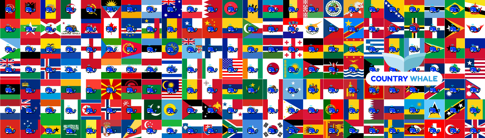

<b>Whales🐋 Have Gone Global. Get Your Country Whale Now.
   
  <a href="https://opensea.io/collection/countrywhale">OPENSEA🐳</a>
  

If You Are a Whale, Then Get Your Country🌏 Whale Now🐳🐋

There Will Be Only 5 Most Rare Whale 🐳 NFTs = Worth Of 20 ETH Each
<ul>
  <li>World Whale🐳</li>
  <li>Universe Whale🐳</li>
  <li>Star Whale🐳</li>
  <li>Galaxy Whale🐳</li>
  <li>Black Hole Whale🐳</li>
</ul>

There Will Be Only 195 Countries Whale🐳 NFTs, So Get Your Country Whale Now OR Never

Thus There Will Be a Grand Total of 200 Whales🐳 NFTs, So These All Whales🐳 Are EXPENSIVE & RARE & UNIQUE 💰💰</b>

- 👀 I’m interested in NFTs
- 💞️ I’m looking to collaborate With NFTs Promoters To Promote my NFTs
- 📫 You Can Reach Me on My <a href="https://twitter/countrywhale.com">Twitter Account</a> OR <a href="mailto:Contact@CountryWhale.com">Email Me</a>
  

<h1>Rare Whale🐳</h1>
 
<h3>Black Hole Whale🐳</h3>
 

 
<h3>Galaxy Whale🐳</h3>
 

 
<h3>Star Whale🐳</h3>
 

 
<h3>Universe Whale🐳</h3>
 

 
<h3>World Whale🐳</h3>
 

<!---
CountryWhale/CountryWhale is a ✨ special ✨ repository because its `README.md` (this file) appears on your GitHub profile.
You can click the Preview link to take a look at your changes.
--->

